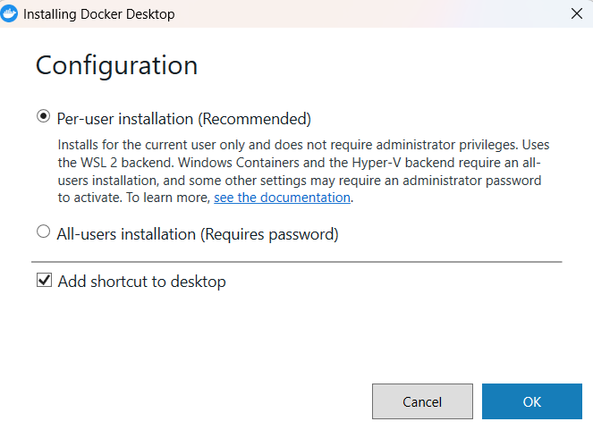
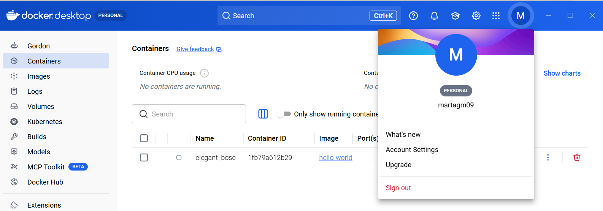
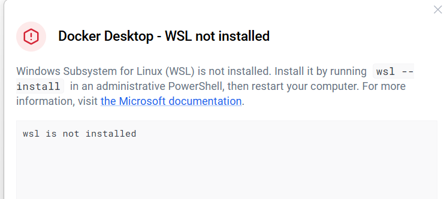
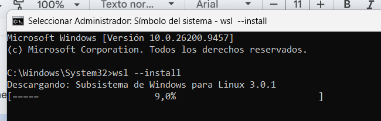
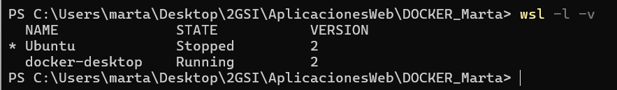
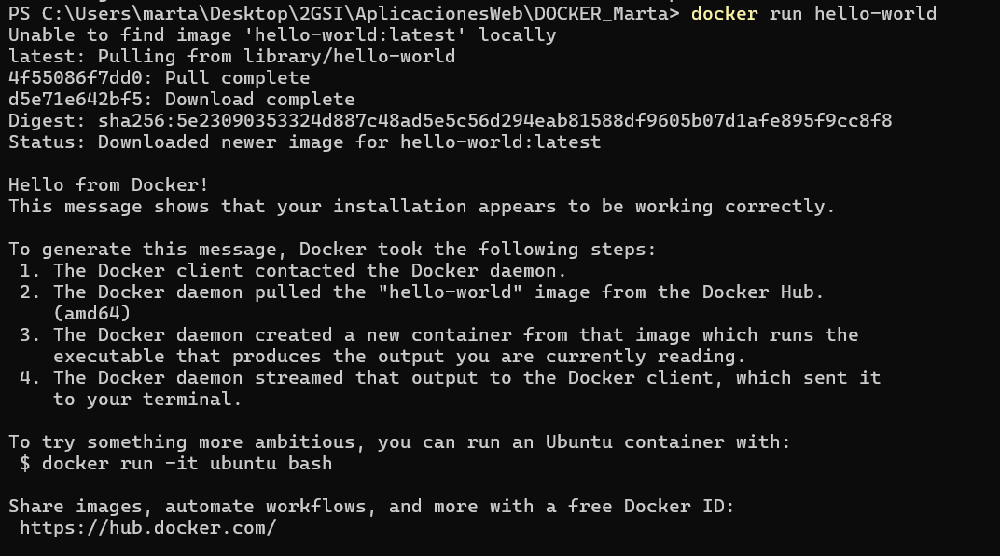

# Configuración e instalación de Docker
---
En este apartado veremos lo que es necesario para configurar e instalar Docker.  
Lo primero que debemos hacer será descargar Docker desde la página oficial de docker, y ejecutar el fichero .exe  

  
Una vez ya tenemos instalado Docker, vamos a seguir los siguientes pasos:  

1. Lo primero que haremos será crearnos una cuenta de dockerhub o bien, como he hecho yo en este caso vincularla con la cuenta de github.

3. Después de vincular la cuenta, me salió el siguiente error que he solucionado instalando el wsl que es lo que necesito para ejecutar Docker en windows.  
  
  

4.Comprobamos que se ha instalado correctamente el wsl y la version de docker.  
  

5.Comprobamos que se ha instalado docker ejecutando el comando "docker run hello-world"
  
